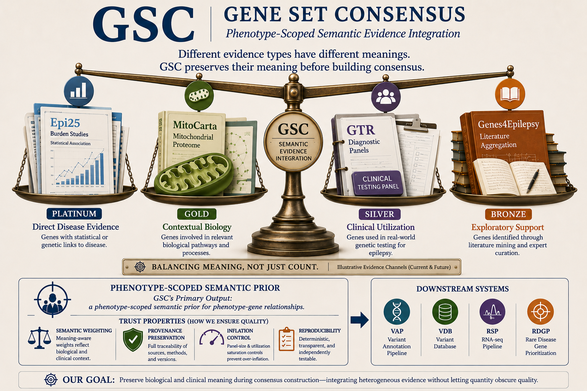
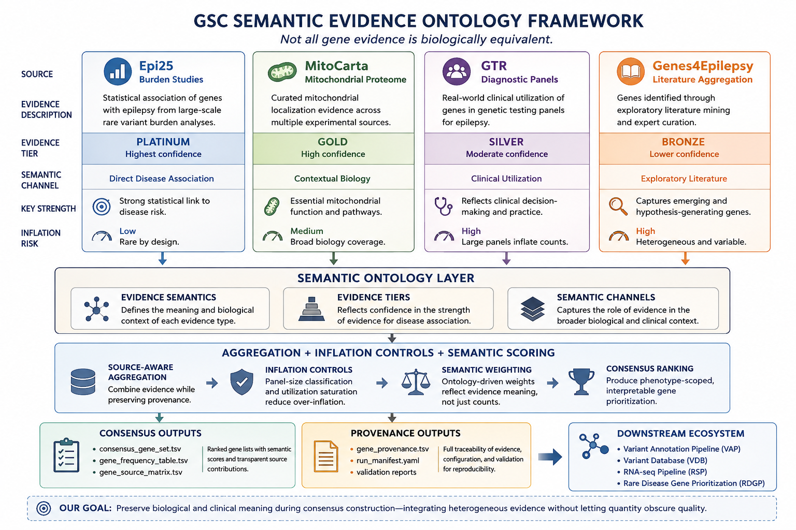
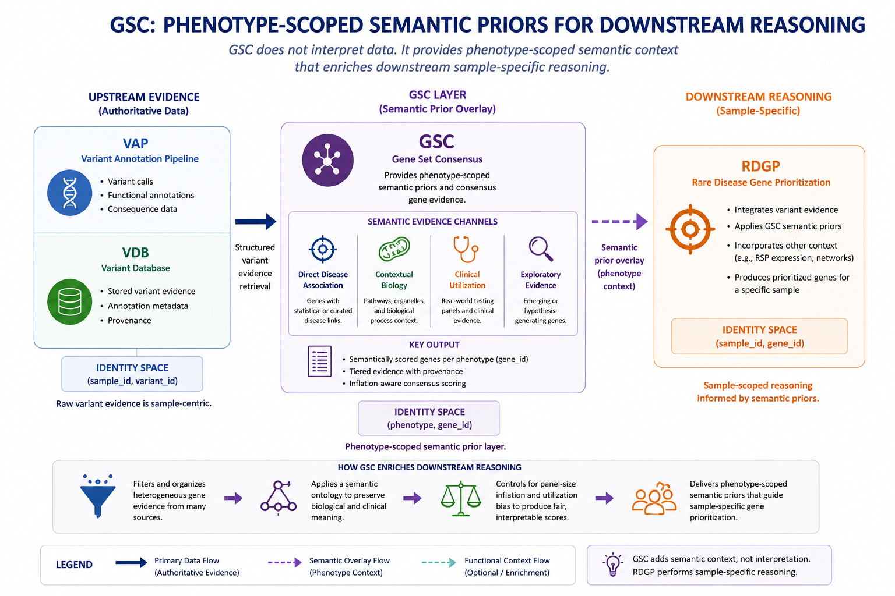

# gene_set_consensus


---



---

`gene_set_consensus` (GSC) is a semantic evidence integration framework for phenotype-scoped consensus gene prioritization.

GSC integrates heterogeneous gene evidence sources into reproducible, provenance-aware consensus gene sets using:

- semantic evidence ontologies
- deterministic aggregation
- inflation-aware scoring controls
- release-driven runtime configuration
- reproducible validation pipelines

GSC is designed as an upstream scientific evidence layer for downstream repositories including:

- `variant_annotation_pipeline` (VAP)
- `variant_database` (VDB)
- `rnaseq_pipeline` (RSP)
- `rare_disease_gene_prioritization` (RDGP)

---

# v1.0 Validation Highlights

Architecture overview:

- [`docs/design/gsc_architecture.md`](docs/design/gsc_architecture.md)

GSC v1.0 includes:

- 46 automated validation tests
- release-driven semantic execution
- subtype-aware epilepsy overlays
- provenance-aware semantic scoring
- cross-system reproducibility validation
- independent Linux HPC validation on MARK
- Sys76 vs MARK semantic comparison artifacts
- runtime portability validation

See:

- [`docs/validation/README.md`](docs/validation/README.md)
- [`docs/validation/comparisons/README.md`](docs/validation/comparisons/README.md)
- [`docs/releases/gsc_v1_release_notes.md`](docs/releases/gsc_v1_release_notes.md)

---

# Scientific Motivation

## Semantic Evidence Ontology Framework



Gene lists originating from different biological and clinical sources are not equally informative. GSC models heterogeneous evidence semantically rather than treating all gene evidence as biologically equivalent.


Examples:

| Evidence Type | Example |
|---|---|
| statistical disease association | Epi25 burden studies |
| curated localization biology | MitoCarta |
| clinical utilization | GTR diagnostic testing panels |
| exploratory literature aggregation | literature-derived epilepsy lists |

Naive overlap counting creates several problems:

- broad clinical testing panels inflate gene importance
- exploratory literature overlap can dominate disease-specific evidence
- contextual biology becomes conflated with causality
- heterogeneous evidence types become difficult to interpret

GSC addresses these issues using a semantic evidence ontology framework that separates:

- evidence semantics
- evidence tiers
- semantic evidence channels
- utilization behavior
- contextual biology
- direct disease association

The goal is not merely to count evidence sources, but to preserve biological and clinical interpretability during consensus construction.

---

# Core Architecture

Detailed architecture documentation:

- [`docs/design/gsc_architecture.md`](docs/design/gsc_architecture.md)

GSC converts:

```text
heterogeneous phenotype-associated gene sources
        ↓
identifier normalization
        ↓
semantic ontology assignment
        ↓
source-aware aggregation
        ↓
inflation-aware semantic scoring
        ↓
provenance-aware consensus outputs
        ↓
downstream translational workflows
```

```text
                    ┌──────────────────────────────┐
                    │ External Gene Evidence       │
                    │------------------------------│
                    │ • Epi25 burden studies       │
                    │ • MitoCarta                  │
                    │ • GTR clinical panels        │
                    │ • Literature-derived lists   │
                    └──────────────┬───────────────┘
                                   │
                                   ▼
                    ┌──────────────────────────────┐
                    │ Source Adapters              │
                    │------------------------------│
                    │ • generic_gene_list          │
                    │ • gtr_panel                  │
                    │ • mitocarta                  │
                    └──────────────┬───────────────┘
                                   │
                                   ▼
                    ┌──────────────────────────────┐
                    │ Identifier Normalization     │
                    │------------------------------│
                    │ • HGNC normalization         │
                    │ • ENSG resolution            │
                    │ • provenance preservation    │
                    └──────────────┬───────────────┘
                                   │
                                   ▼
                    ┌──────────────────────────────┐
                    │ Semantic Ontology Assignment │
                    │------------------------------│
                    │ • evidence_semantics         │
                    │ • evidence_tiers             │
                    │ • semantic_channels          │
                    └──────────────┬───────────────┘
                                   │
                                   ▼
                    ┌──────────────────────────────┐
                    │ Aggregation + Inflation      │
                    │ Controls                     │
                    │------------------------------│
                    │ • panel-size classification  │
                    │ • utilization saturation     │
                    │ • deterministic aggregation  │
                    └──────────────┬───────────────┘
                                   │
                                   ▼
                    ┌──────────────────────────────┐
                    │ Semantic Scoring Profiles    │
                    │------------------------------│
                    │ • phenotype-specific scoring │
                    │ • semantic weighting         │
                    │ • ontology-aware ranking     │
                    └──────────────┬───────────────┘
                                   │
                ┌──────────────────┴──────────────────┐
                ▼                                     ▼
┌──────────────────────────────┐      ┌──────────────────────────────┐
│ Consensus Outputs            │      │ Provenance Outputs           │
│------------------------------│      │------------------------------│
│ • consensus_gene_set.tsv     │      │ • gene_provenance.tsv        │
│ • gene_frequency_table.tsv   │      │ • run_manifest.yaml          │
│ • gene_source_matrix.tsv     │      │ • validation reports         │
└──────────────────────────────┘      └──────────────────────────────┘
                                   │
                                   ▼
                    ┌──────────────────────────────┐
                    │ Downstream Ecosystem         │
                    │------------------------------│
                    │ • VAP                        │
                    │ • VDB                        │
                    │ • RSP                        │
                    │ • RDGP                       │
                    └──────────────────────────────┘
```

Core architectural principles:

- deterministic execution
- provenance preservation
- reproducibility
- phenotype-scoped execution
- semantic explainability
- release-driven runtime configuration
- ontology validation
- backward-compatible migration strategy

---

# Semantic Ontology System

GSC uses explicit semantic evidence separation rather than naive source counting.

## Evidence Semantics

Examples:

| Semantic Meaning | Example |
|---|---|
| `statistical_association` | Epi25 burden evidence |
| `functional_localization` | MitoCarta mitochondrial localization |
| `clinical_utilization` | GTR diagnostic panel utilization |
| `exploratory_literature` | literature-derived gene aggregation |

---

## Evidence Tiers

Examples:

| Tier | Interpretation |
|---|---|
| `platinum` | strong direct disease evidence |
| `gold` | strong contextual biology |
| `silver` | supporting utilization evidence |
| `bronze` | exploratory evidence |

---

## Semantic Channels

Examples:

| Channel | Interpretation |
|---|---|
| `direct_disease` | direct disease association |
| `clinical_utilization` | clinical testing prevalence |
| `contextual_biology` | biologically relevant context |
| `exploratory_literature` | hypothesis-generating evidence |

---

# Inflation Controls

GSC includes semantic inflation controls designed to suppress artificial score inflation from broad clinical testing panels.

Example problem:

```text
Gene A:
- appears in one highly specific epilepsy burden study

Gene B:
- appears in hundreds of broad exome diagnostic panels
```

Naive counting incorrectly prioritizes Gene B.

GSC mitigates this using:

- semantic evidence separation
- utilization-specific channels
- panel-size classification
- utilization saturation logic
- deterministic aggregation controls

Broad utilization evidence is preserved for interpretability but prevented from overwhelming direct disease evidence.

---

# Release-Driven Runtime

Modern GSC execution is release-driven.

Example:

```bash
python run_pipeline.py \
  --release config/releases/epilepsy_semantic_gtr_experimental_v0.1.yaml
```

Current semantic epilepsy-family releases include:

| Release | Direct disease anchor | Interpretation |
|---|---|---|
| `epilepsy_semantic_gtr_experimental_v0.1` | Epi25 EPI high-confidence genes | broad epilepsy semantic overlay |
| `dee_semantic_gtr_experimental_v0.1` | Epi25 DEE high-confidence genes | developmental and epileptic encephalopathy subtype overlay |
| `nafe_semantic_gtr_experimental_v0.1` | Epi25 NAFE high-confidence genes | non-acquired focal epilepsy subtype overlay |

GGE is intentionally not represented as a high-confidence semantic release because no GGE genes reached the configured 2024 Epi25 high-significance threshold.

Release manifests define:

- phenotype configuration
- scoring profiles
- source manifests
- release metadata
- semantic evidence expectations
- provenance expectations

This architecture supports:

- reproducible execution
- frozen release behavior
- phenotype-specific scoring strategies
- downstream auditability

---

# Scoring Profiles

GSC supports phenotype-specific semantic scoring profiles.

Current examples include:

- `epilepsy_semantic_v0.1.yaml`
- `mitochondrial_semantic_v0.1.yaml`

Scoring profiles control:

- active scoring mode
- semantic weighting behavior
- utilization handling
- inflation suppression
- semantic channel interpretation

Current semantic scores remain deterministic and heuristic rather than probabilistic.

---

# Validation and Testing

GSC includes extensive automated validation.

Current test suite:

```text
46 automated tests
```

Validation coverage includes:

- ontology validation
- semantic namespace locking
- inflation control validation
- release-runtime validation
- scoring-profile validation
- provenance joinability
- output contract validation
- identifier normalization behavior
- GTR scope classification
- semantic output validation
- deterministic reproducibility

Example:

```bash
pytest
```

Release validation:

```bash
python scripts/validation/validate_release_manifest.py \
  --release config/releases/epilepsy_semantic_gtr_experimental_v0.1.yaml
```

Scoring profile validation:

```bash
python scripts/validation/validate_scoring_profile.py \
  --profile config/scoring_profiles/epilepsy_semantic_v0.1.yaml
```

---

# Repository Evolution

GSC evolved through several architectural phases.

## Phase 1 — Source Count Architecture

- direct overlap counting
- deterministic but semantically naive

## Phase 2 — Weighted Tier Architecture

- introduced weighted evidence tiers
- improved prioritization behavior
- still lacked semantic separation

## Phase 3 — Semantic Ontology Architecture

Current generation:

- semantic evidence channels
- ontology validation
- inflation controls
- release-driven runtime
- semantic scoring profiles
- provenance-aware semantic outputs

See:

```text
docs/migration/semantic_migration.md
```

for additional migration details.

---

# Quick Start

## Environment Setup

```bash
python -m venv .venv
source .venv/bin/activate
pip install -r requirements.txt
```

---

## Run Semantic Epilepsy Release

```bash
python run_pipeline.py \
  --release config/releases/epilepsy_semantic_gtr_experimental_v0.1.yaml
```

---

## Run DEE Subtype Semantic Release

```bash
python run_pipeline.py \
  --release config/releases/dee_semantic_gtr_experimental_v0.1.yaml
```

---

## Run NAFE Subtype Semantic Release

```bash
python run_pipeline.py \
  --release config/releases/nafe_semantic_gtr_experimental_v0.1.yaml
```

---

## Run Semantic Mitochondrial Release

```bash
python run_pipeline.py \
  --release config/releases/mitochondrial_semantic_gtr_experimental_v0.1.yaml
```

---

## Run Validation Suite

```bash
pytest
```

---

# Example Outputs

Curated semantic interpretation examples are available under:

```text
docs/examples/
```

Including:

- epilepsy semantic ranking examples
- DEE subtype semantic ranking examples
- NAFE subtype semantic ranking examples
- mitochondrial semantic ranking examples
- curated semantic output tables
- ontology-aware interpretation walkthroughs

See:
- [Epilepsy: Semantic Output Example](docs/examples/epilepsy_semantic_output_example.md)
- [DEE: Semantic Output Example](docs/examples/dee_semantic_output_example.md)
- [NAFE: Semantic Output Example](docs/examples/nafe_semantic_output_example.md)
- [Mitochondria: Semantic Output Example](docs/examples/mitochondrial_semantic_output_example.md)
- [Example Readme](docs/examples/README.md)

Example semantic interpretation walkthrough:
- [`docs/examples/dee_semantic_walkthrough.md`](docs/examples/dee_semantic_walkthrough.md)

GSC generates provenance-aware semantic outputs including:

| Output | Purpose |
|---|---|
| `consensus_gene_set.tsv` | final semantic consensus ranking |
| `gene_source_matrix.tsv` | source presence matrix |
| `gene_frequency_table.tsv` | aggregated semantic evidence table |
| `gene_provenance.tsv` | provenance-aware source traceability |
| `run_manifest.yaml` | runtime execution metadata |
| `validation_report.md` | validation summary |
| `output_contract_validation.tsv` | output schema validation |

---

# Repository Structure

| Folder | Purpose |
|---|---|
| `config/` | phenotype configs, scoring profiles, releases |
| `data/example/` | toy reproducible example datasets |
| `docs/` | architecture, migration, governance |
| `manifests/sources/` | source provenance manifests |
| `scripts/` | pipeline execution and validation scripts |
| `src/gene_set_consensus/` | reusable package code |
| `tests/` | unit, integration, and validation tests |
| `results/` | generated outputs (not committed) |
| `logs/` | generated logs (not committed) |

---

# Source Adapters

GSC separates:

```text
biological source meaning
≠
file parsing strategy
```

## Source Types

Examples:

- `curated_database`
- `clinical_panel`
- `literature_derived`
- `consortium_wes_burden`

## Adapters

Examples:

- `generic_gene_list`
- `gtr_panel`
- `mitocarta`

This separation allows biologically distinct sources to reuse parsing logic while preserving semantic interpretation.

---

# Real Source Storage

Real source files should not be committed to Git.

Recommended staging locations:

| System | Gene Sets | GTR |
|---|---|---|
| sys76 | `/mnt/storage/gene_sets/` | `/mnt/storage/gtr/` |
| MARK | `/data/storage/gene_sets/` | `/data/storage/gtr/` |

Phenotype configs reference staged files using explicit file paths.

---

# Real Source Ingestion: MitoCarta

MitoCarta ingestion is operator-staged rather than automatically downloaded.

Reasons:

- source schemas may change
- provenance should remain auditable
- acquisition versions should remain explicit
- large external resources should remain outside Git

Expected staging:

```text
/mnt/storage/gene_sets/mitocarta/
```

Recommended staged files:

```text
/mnt/storage/gene_sets/mitocarta/Human.MitoCarta3.0.xls
/mnt/storage/gene_sets/mitocarta/mitocarta_human.tsv
```

The original downloaded Excel workbook should always be preserved.

The MitoCarta adapter reads native MitoCarta columns directly and performs schema translation internally.

---

# Assumptions

- input gene lists are phenotype-associated
- absence from a source is not negative evidence
- semantic interpretation depends on configured ontology assignments
- identifier normalization depends on configured mapping resources
- semantic scores are deterministic and reproducible

---

# Limitations

- semantic scoring remains heuristic rather than probabilistic
- phenotype ontology harmonization remains limited in v1
- automated external source acquisition is intentionally limited
- literature mining is not yet automated
- cross-phenotype semantic calibration remains future work
- semantic governance remains curated rather than learned

---

# Cross-System Reproducibility

GSC v1.0 was validated across independent systems:

| Environment | Role |
|---|---|
| Sys76 Pop!_OS workstation | primary development |
| MARK Linux HPC environment | independent reproducibility validation |

Validation demonstrated:

- release portability
- semantic reproducibility
- deterministic subtype reconstruction
- provenance-preserving semantic outputs
- portable runtime overlays

See:

- [`docs/validation/README.md`](docs/validation/README.md)
- [`docs/validation/comparisons/README.md`](docs/validation/comparisons/README.md)
- [`docs/design/runtime_portability_refactor.md`](docs/design/runtime_portability_refactor.md)

---

# Documentation Map

| Document | Purpose |
|---|---|
| `docs/design/gsc_architecture.md` | architecture overview |
| `docs/examples/dee_semantic_walkthrough.md` | semantic interpretation walkthrough |
| `docs/validation/README.md` | validation subsystem |
| `docs/validation/comparisons/README.md` | Sys76 vs MARK reproducibility comparisons |
| `docs/design/runtime_portability_refactor.md` | runtime portability rationale |
| `docs/releases/gsc_v1_release_checklist.md` | v1 release validation checklist |
| `docs/releases/gsc_v1_release_notes.md` | v1.0 release notes |

---

# Future Directions

Planned future directions include:

- ClinVar semantic integration
- OMIM integration
- PanelApp integration
- GenCC integration
- transcriptomic convergence overlays
- network convergence scoring
- noncoding regulatory integration
- phenotype ontology propagation
- subtype-aware epilepsy semantic overlays
- semantic conflict resolution
- probabilistic semantic scoring

---

# Downstream Ecosystem Integration

GSC is designed as a reusable upstream evidence framework.

Potential downstream uses include:

| Repository | Example Use |
|---|---|
| `VAP` | variant prioritization overlays |
| `VDB` | semantic evidence persistence |
| `RSP` | transcriptomic convergence overlays |
| `RDGP` | rare disease gene prioritization |

---



The GSC Semantic Prior Integration Framework illustrates how phenotype-scoped semantic evidence from GSC enriches downstream sample-specific reasoning without replacing authoritative variant evidence. GSC acts as a semantic overlay layer that preserves biological meaning and clinical context while enabling more interpretable gene prioritization in RDGP.

---

# License

MIT License

---

# Development Status

Current architecture status:

```text
semantic ontology architecture
release-driven runtime
deterministic semantic scoring
active development
```

---

# References

- Epi25 Collaborative. Exome sequencing of 20,979 individuals with epilepsy reveals shared and distinct ultra-rare genetic risk across disorder subtypes. Nat Neurosci. 2024;27(10):1864-1879. doi:10.1038/s41593-024-01747-8

- Rath S, Sharma R, Gupta R, et al. MitoCarta3.0: an updated mitochondrial proteome now with sub-organelle localization and pathway annotations. Nucleic Acids Res. 2021;49(D1):D1541-D1547. doi:10.1093/nar/gkaa1011
