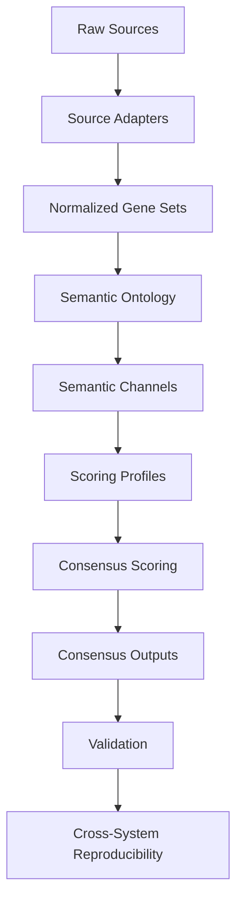

# GSC Architecture Overview

## Purpose

GSC (Gene Set Consensus) is a reproducible semantic bioinformatics framework for integrating heterogeneous biological evidence sources into provenance-aware consensus gene sets.

The framework emphasizes:

- semantic evidence layering
- source provenance preservation
- reproducible release-driven execution
- phenotype-aware semantic scoring
- subtype-aware semantic overlays
- cross-system reproducibility

GSC constructs phenotype-aware semantic candidate universes from heterogeneous biological evidence sources.

---

# High-Level Architecture



---

# Source Layer

GSC integrates heterogeneous biological evidence sources including:

| Source Type | Example |
|---|---|
| Clinical testing utilization evidence | GTR |
| Curated disease gene sets | Genes4Epilepsy |
| Contextual mitochondrial biology | MitoCarta |
| Publication-derived subtype anchors | Epi25 |

Sources may originate from:

- TSV
- CSV
- XLS/XLSX
- XML
- browser-derived exports
- publication-derived curated tables

---

# Adapter Layer

Adapters transform heterogeneous external sources into normalized GSC-compatible semantic evidence tables.

Example responsibilities include:

- schema normalization
- identifier normalization
- phenotype labeling
- evidence class assignment
- provenance preservation

Examples:

| Adapter | Purpose |
|---|---|
| MitoCarta adapter | mitochondrial contextual biology |
| Epi25 builder | epilepsy subtype anchor reconstruction |
| GTR parser | clinical testing evidence extraction |

---

# Normalization Layer

Normalized outputs preserve provenance-aware source attribution throughout downstream scoring and release execution.

Normalized gene evidence is merged into a shared semantic candidate universe.

Normalization includes:

- gene symbol harmonization
- duplicate resolution
- phenotype assignment
- source tracking
- evidence tier preservation

---

# Semantic Ontology Layer

GSC organizes evidence into semantic channels rather than treating all evidence sources equally.

- This prevents clinically distinct evidence types from collapsing into a single undifferentiated aggregate score.
- This permits biologically interpretable scoring behavior.

Current semantic channels include:

| Semantic Channel | Purpose |
|---|---|
| direct_disease | direct disease/subtype anchors |
| contextual_biology | biologically related contextual evidence |
| utilization | clinical/research utilization evidence |
| exploratory | exploratory or lower-confidence evidence |

---

# Scoring Layer

Semantic channels are combined through configurable scoring profiles.

Scoring profiles define:

- source weights
- semantic channel weights
- aggregation behavior
- active score selection
- inflation controls

Current scoring profiles include:

| Profile | Phenotype Family |
|---|---|
| epilepsy_semantic_v0.1 | epilepsy-family releases |
| mitochondrial_semantic_v0.1 | mitochondrial releases |

---

# Release-Driven Runtime

Release manifests act as portable execution contracts for phenotype-aware semantic builds.

GSC execution is release-driven.

Release manifests define:

- phenotype configs
- source manifests
- scoring profiles
- runtime execution behavior

Example:

```bash
python run_pipeline.py \
  --release config/releases/dee_semantic_gtr_experimental_v0.1.yaml
```

---

# Subtype-Aware Semantic Releases

Epilepsy-family releases preserve subtype-specific semantic anchors.

Current subtype-aware releases include:

| Release | Semantic Focus |
|---|---|
| epilepsy semantic | broad epilepsy overlay |
| DEE semantic | developmental and epileptic encephalopathy |
| NAFE semantic | non-acquired focal epilepsy |
| mitochondrial semantic | mitochondrial disease biology |

DEE and NAFE releases preserve subtype-specific semantic anchors while operating over the shared epilepsy-family semantic candidate universe.

---

# Validation Architecture

GSC includes multiple validation layers:

| Validation Layer | Purpose |
|---|---|
| unit tests | component correctness |
| output contract validation | schema/runtime correctness |
| release validation | manifest correctness |
| scoring profile validation | semantic scoring correctness |
| source manifest validation | source-layer correctness |
| cross-system validation | semantic reproducibility across infrastructure |

---

# Cross-System Reproducibility

GSC was validated on:

| Environment | Purpose |
|---|---|
| Sys76 Pop!_OS workstation | primary development |
| MARK Linux HPC environment | independent reproducibility validation |

MARK validation demonstrated:

- portable release execution
- deterministic subtype reconstruction
- reproducible semantic scoring behavior
- runtime portability via local overlays
- preserved semantic interpretation across systems

See:

- `../validation/README.md`

---

# Output Layer

Primary outputs include:

| Output | Purpose |
|---|---|
| consensus_gene_set.tsv | final scored semantic consensus |
| source_matrix.tsv | source-by-gene semantic matrix |
| semantic reports | semantic interpretation summaries |
| validation artifacts | reproducibility evidence |

---

# Design Philosophy

GSC prioritizes:

- semantic interpretability
- provenance preservation
- reproducibility
- biologically meaningful evidence layering
- modular source integration
- release-driven execution
- cross-system portability

The framework intentionally distinguishes:

- semantic reproducibility
from
- byte-identical runtime outputs

because runtime metadata may legitimately differ across independent executions.